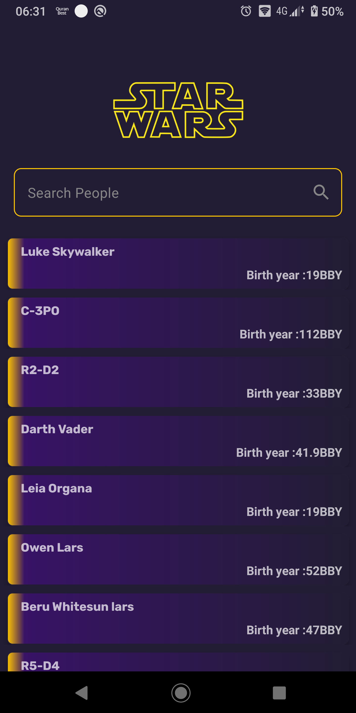
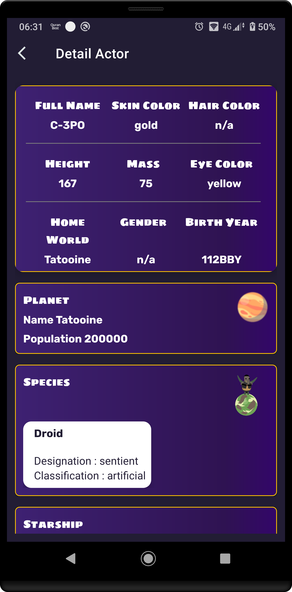
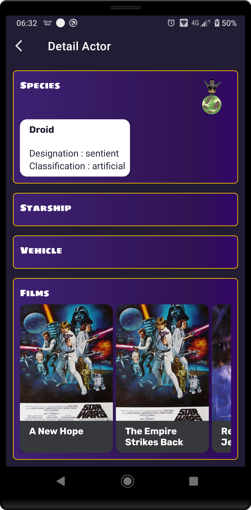

# StarWars
An Android app built with Kotlin, consuming [StarWars API](https://swapi.dev/) to display characters of the popular StarWars Movie. It is built with the MVVM pattern and the latest Jetpack components.
## Demo
  

## Setup Requirements
- Android device or emulator
- Android Studio